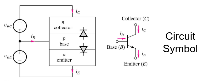
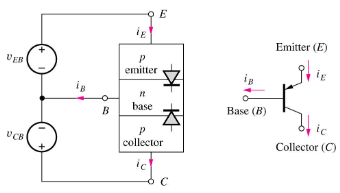

# Bipolar Junction Transistor

Bipolar junction [[Transistor|transistors]] are three-layer devices consisting of alternating layers of n- and p-type [[Semiconductor|semiconductors]], called the emitter (E), the base (B), and the collector (C).

Given this, there are two basic types of BJTs: NPN and PNP, matching their layering.

## Simplified Model

A simplified model for a BJT exists, consisting of two [[Diode|diodes]] placed back-to-back. This model shows more easily the source of the 4 operational regions for a BJT.

## Comparing Types of Bipolar Junction Transistors

| Type | Circuit Symbol  | KVL                    | KCL                 | Further Notes          |
| ---- | --------------- | ---------------------- | ------------------- | ---------------------- |
| NPN  |  | $V_{CE}=V_{BE}-V_{BC}$ | $I_{E}=I_{B}+I_{C}$ | $i_{B}$ is significant |
| PNP  |  | $V_{EC}=V_{EB}-V_{CB}$ | $I_{E}=I_{B}+I_{C}$ |                        |

## Operation Regions

| BE Junction | BC Junction | Region of Operation |
| ----------- | ----------- | ------------------- |
| Forward     | Reverse     | Forward Active      |
| Reverse     | Forward     | Reverse Active      |
| Reverse     | Reverse     | Cutoff              |
| Forward     | Forward     | Saturation          |

### Forward Active

### Reverse Active

### Cutoff

### Saturation

## Biasing

